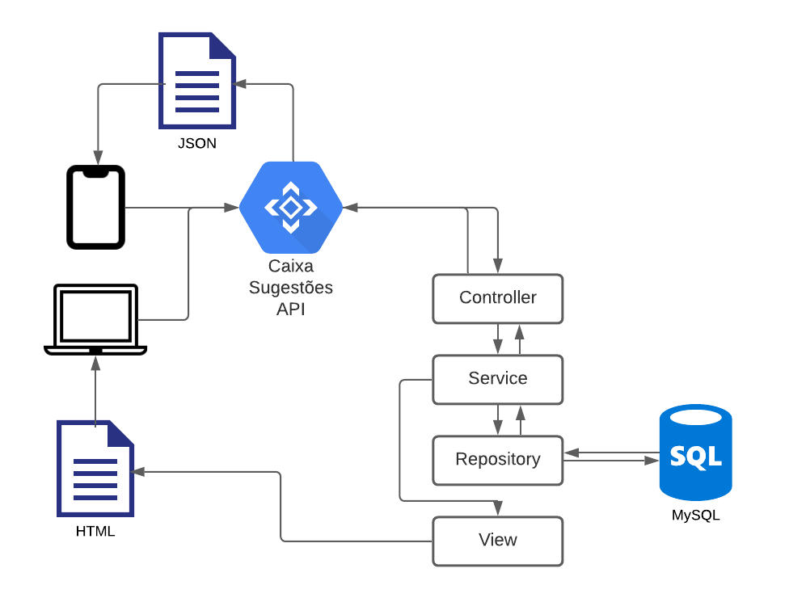

# Projeto Final - Programação para Internet

Este projeto tem por objetivo criar uma API REST para integração com um aplicativo Android para armazennar as sugestões dos alunos da Etec Artur Nogueira. Nele, iremos consolidar nossos conhecimentos em Java, Orientação a Objetos, REST APIs e utilização de novas tecnologias para o desenvolvimento de Aplicações Web

> Esta API além de atuar como back-end do aplicativo, irá prover inicialmente uma página de exibição das sugestões registradas; será utilizado o Framework Matheriaze para prover a aparência mais próxima possível de uma aplicação Android Nativa.

> A aplicação foi desenvolvida utilizando boas práticas de programação, sendo construída em camadas as as responsabilidades bem definidas conforme a ilutração abaixo.



# PARTE I - Criar API

## Criar projeto Spring Boot

Primeiramente iremos criar um projeto Spring Boot e configurar todas dependencias necessária.

Para facilitar a criação do projeto; iremos criar o projeto na aplicação web [initializr](https://start.spring.io/)

Crie o projeto conforme o modelo abaixo atentando-se às dependencias indicadas


Após baixar o projeto com suas dependencias, descompacte-o e o abra com o IntelliJ Idea. A IDE irá realizar o download de todas as dependencias necessárias e realizar o `build`.

## Criar a modelagem do Banco de dados com ORM

Neste projeto utilizaremos a modelagem objeto-relacional, ao invés de criarmos os scripts de banco de dados, o `JPA` se encarregará de criar as tabelas e inicializar a conexão com o Banco de dados.

1. Crie o pacote `model.entity` no pacote principal.
2. Crie a classe `Sugestao.java` no pacote `entity`.

```java
@Entity
public class Sugestao {

    @Id
    @GeneratedValue(strategy = GenerationType.IDENTITY)
    private Long id;
    @NotBlank(message = "Conteúdo é obrigatório")
    private String conteudo;
    @NotBlank(message = "Curso é obrigatório")
    private String curso;
    @NotBlank(message = "Tipo é obrigatório")
    private String tipo;
    private String nome;
    @JsonProperty("data-hora")
    @Column(columnDefinition = "TIMESTAMP DEFAULT CURRENT_TIMESTAMP")
    private LocalDateTime dataHora = LocalDateTime.now();

    public Sugestao(String conteudo, String curso, String tipo, String nome) {
        this.conteudo = conteudo;
        this.curso = curso;
        this.tipo = tipo;
        this.nome = nome;
    }

    public Sugestao() {
    }

    public Long getId() {
        return id;
    }

    public Sugestao setId(Long id) {
        this.id = id;
        return this;
    }

    public String getConteudo() {
        return conteudo;
    }

    public Sugestao setConteudo(String conteudo) {
        this.conteudo = conteudo;
        return this;
    }

    public String getCurso() {
        return curso;
    }

    public Sugestao setCurso(String curso) {
        this.curso = curso;
        return this;
    }

    public String getTipo() {
        return tipo;
    }

    public Sugestao setTipo(String tipo) {
        this.tipo = tipo;
        return this;
    }

    public String getNome() {
        return nome;
    }

    public Sugestao setNome(String nome) {
        this.nome = nome;
        return this;
    }

    public LocalDateTime getDataHora() {
        return dataHora;
    }

    public Sugestao setDataHora(LocalDateTime dataHora) {
        this.dataHora = dataHora;
        return this;
    }

    @Override
    public String toString() {
        return "Sugestao{" +
                "id=" + id +
                ", conteudo='" + conteudo + '\'' +
                ", curso='" + curso + '\'' +
                ", tipo='" + tipo + '\'' +
                ", nome='" + nome + '\'' +
                ", dataHora='" + dataHora + '\'' +
                '}';
    }
}
```

## Crie o CRUD utiliando os Repositories do Spring Boot

1. Crie o pacote `model.repository`;
2. Crie a interface `SugestaoRepository` no pacote `repository`;

```java
public interface SugestaoRepository extends JpaRepository<Sugestao, Long> {
}
```

Sim. E só isso mesmo! Esta interface já nos provê os métodos CRUD convencionais e muitos outros métodos de manipulação de dados.

### Configure o acesso à base de dados

Edite o arquivo `application.properties` no diretório `resources` para que seja compatível com sua base de dados local.

```properties
server.port=9000
spring.datasource.url=jdbc:mysql://localhost:3306/etec
spring.datasource.username=root
spring.datasource.password=

spring.jpa.database-platform=org.hibernate.dialect.MySQL5Dialect
spring.jpa.hibernate.ddl-auto=create
spring.jpa.show-sql=true
spring.jpa.properties.hibernate.format_sql=true
```

## Criando a API para suporte ao aplicativo

As próxima etapas irão guiá-lo para a criação da API seguindo boas práticas de programação; iremos criar a aplicação em camadas, com as responsabilidades bem definidas.

Já temos a camada `Model` definida com o entity e o repository definidos; vamos criar a camada de serviço para que a responsabilidade da camada `Model` contenha-se apenas na persistência de dados e a lógica utilizada fique na camada de serviço.

### Service

1. Crie o pacote `service.impl`;
2. Crie a interface `ISugestaoService` no pacote `service`.

```java
public interface ISugestaoService {
    Sugestao salvar(Sugestao sugestao);
    List<Sugestao> buscarTodos();
    Optional<Sugestao> buscarPorId(Long id);
}
```

3. Crie a classe `SugestaoService` no pacote `service.impl`

```java
@Service
public class SugestaoService implements ISugestaoService {

    private static final Map<String, String> mCursos = Map.of(
            "sistemas", "Desenvolvimento de Sistemas",
            "administracao", "Administração",
            "logistica", "Logística");

    private static final Map<String, String> mTipoSugestao = Map.of(
            "sugestao", "Sugestão",
            "reclamacao", "Reclamação",
            "comentario", "Comentário",
            "elogio", "Elogio"
    );

    private static final Map<String, String> mUrlImagens = Map.of(
            "sugestao", "idea.png",
            "reclamacao", "brokenheart.png",
            "comentario", "chat.png",
            "elogio", "like.png"
    );

    @Autowired
    private SugestaoRepository repository;

    @Override
    public Sugestao salvar(Sugestao sugestao) {
        return repository.save(sugestao);
    }

    @Override
    public List<SugestaoDTO> buscarTodos() {
        List<SugestaoDTO> sugestoes = repository.findAll()
                .stream()
                .map(s -> new ModelMapper().map(s, SugestaoDTO.class))
                .collect(Collectors.toList());

        sugestoes.forEach(s -> {
            s.setUrlImagem(mUrlImagens.get(s.getTipo()));
            s.setCurso(mCursos.get(s.getCurso()));
            s.setTipo(mTipoSugestao.get(s.getTipo()));
        });

        return sugestoes;

    }

    @Override
    public Optional<Sugestao> buscarPorId(Long id) {
        return repository.findById(id);
    }
}
```

## API Resources

A API irá interagir diretamente com o aplicativo e os navegadores que por ventura venhas a realizar requisições para nossa aplicação.

Para que ela consiga capturar as requisições e responder corretamente aos clientes, vamos criar os resources ou end-points que capturem as requisições e encaminhem para nossa camada de serviço para o devido tratamento e resposta.

1. Crie os pacotes:
* api
    * dto
    * resource
2. Crie a classe `SugestaoDTO` no pacote `api.dto` para que possamos trafegar apenas os dados necessários para a requisição sem expor dados desnecessários da entity.

```java
public class SugestaoDTO {

    private Long id;
    private String conteudo;
    private String curso;
    private String tipo;
    private String nome;
    private LocalDateTime dataHora = LocalDateTime.now();
    private String urlImagem;

    public SugestaoDTO(String conteudo, String curso, String tipo, String nome) {
        this.conteudo = conteudo;
        this.curso = curso;
        this.tipo = tipo;
        this.nome = nome;
    }

    public SugestaoDTO() {
    }

    public Long getId() {
        return id;
    }

    public SugestaoDTO setId(Long id) {
        this.id = id;
        return this;
    }

    public String getConteudo() {
        return conteudo;
    }

    public SugestaoDTO setConteudo(String conteudo) {
        this.conteudo = conteudo;
        return this;
    }

    public String getCurso() {
        return curso;
    }

    public SugestaoDTO setCurso(String curso) {
        this.curso = curso;
        return this;
    }

    public String getTipo() {
        return tipo;
    }

    public SugestaoDTO setTipo(String tipo) {
        this.tipo = tipo;
        return this;
    }

    public String getNome() {
        return nome;
    }

    public SugestaoDTO setNome(String nome) {
        this.nome = nome;
        return this;
    }

    public LocalDateTime getDataHora() {
        return dataHora;
    }

    public SugestaoDTO setDataHora(LocalDateTime dataHora) {
        this.dataHora = dataHora;
        return this;
    }

    public String getUrlImagem() {
        return urlImagem;
    }

    public SugestaoDTO setUrlImagem(String urlImagem) {
        this.urlImagem = urlImagem;
        return this;
    }
}
```

### Endpoint para cadastro sugestões

O endpoint é responsável por capturar a requisição do aplicativo e persistir a sugestão na base de dados

#### Crie o endpoint SugestaoController

No pacote `api.resource` crie a classe `SugestaoController`.

```java
@RestController
@RequestMapping("/api/v1")
public class SugestaoController {

    @Autowired
    private ISugestaoService service;

    @GetMapping("/sugestoes")
    public ResponseEntity findAll() {
        List<dev.esdras.e104caixasugestoes.model.dto.SugestaoDTO> sugestoes = service.buscarTodos();

        if (sugestoes.isEmpty()) return ResponseEntity.notFound().build();

        return ResponseEntity.ok().body(sugestoes);
    }

    @GetMapping("/sugestao/{id}")
    public ResponseEntity findById(@PathVariable Long id) {
        Optional<Sugestao> sugestao = service.buscarPorId(id);
        if (sugestao.isPresent()) {
            SugestaoDTO sugestaoDTO = new ModelMapper()
                    .map(sugestao.get(), SugestaoDTO.class);
            return ResponseEntity.ok().body(sugestaoDTO);
        }
        return ResponseEntity.notFound().build();
    }

    @PostMapping("/sugestao")
    public ResponseEntity salvar(@RequestBody Sugestao sugestao) {
        Sugestao sugestaoSalva = service.salvar(sugestao);
        if(Objects.nonNull(sugestaoSalva.getId())) {
            URI uri = ServletUriComponentsBuilder.fromCurrentRequest().path("/{id}")
                    .buildAndExpand(sugestaoSalva.getId()).toUri();
            return ResponseEntity.created(uri).build();
        }
        return ResponseEntity.notFound().build();
    }
}
```
## API concluída

Realize o teste da API; primeiramente execute o projeto e confira o log da aplicação.

Após certificar-se que a aplicação subiu, abra o link da aplicação no navegador, o link é [localhost](http://localhost:9000/api/v1/sugestao/1) `http://localhost:9000/api/v1/sugestoes`;

Neste ponto ainda não temos registros criados, então para testar a API precisamos criar uma requisição web.

Podemos criar uma requisição web facilmente com o `Postman`, mas para simplificar, vamos baixar o programa `Cmder`, ele é um shell simulado do ambiente GNU/Linux ao qual podemos fazer uma requisição via shell. Baixe-o [aqui](https://cmder.net/)

Execute uma nova requisição para a aplicação com o comando:

```shell
   curl -X POST http://localhost:9000/api/v1/sugestao  -H 'Content-Type: application/json'  -d '{ "conteudo": "Lorem ipsum dolor sit amet, consectetur adipiscing elit. Phasellus iaculis ultricies mollis. Phasellus vel euismod nisi. ", "curso": "sistemas",  "tipo": "sugestao",  "nome": "Aluno Etec CPS"}'
```
> Voce poderia realizar a requisição diretamente pelo shell casi use um sistema Linux, ou tenha o Linux via WSL2 no Windows 10, mas usar o Postman ou Insomina é uma opção mais viável. 

# PARTE II - Criar Camada VIEW

## Criar a página de apresentação de Sugestões com Thymeleaf

Agora iremos criar uma página web que utilize a API com base no padrão MVC, utilizando as templates `Thymeleaf`.

1. Crie o arquivo `resources/templates/index.html` utilizando o `Matherialize`. A template irá receber os dados de um controlador e exibir os dados recebidos com base no MVC. Observe que ao criarmos o atributo customizado do Thymeleaf `xmlns:th="www.thymeleaf.org"`, dentro da tag `<html></html>`, podemos usar efetivamente o poder das templates podendo realizar a substituição dos dados recebidos pelos Controllers de forma simplidicada, atente-se aos trechos que contenham `th:`. Você pode encontrar mais informações neste. [link](https://www.thymeleaf.org/doc/tutorials/2.1/usingthymeleaf.html)

```html
<!DOCTYPE html>
<html lang="en" xmlns:th="www.thymeleaf.org">
<head>
    <meta charset="UTF-8">
    <title>Caixa Sugestões Etec Artur Nogueira</title>
    <link href="https://fonts.googleapis.com/icon?family=Material+Icons" rel="stylesheet">
    <link rel="stylesheet" href="https://cdnjs.cloudflare.com/ajax/libs/materialize/1.0.0/css/materialize.min.css">
    <meta name="viewport" content="width=device-width, initial-scale=1.0"/>
</head>
<body>
<nav>
    <div class="nav-wrapper">
        <a href="#!" class="brand-logo"><i class="material-icons">model_training</i>Logo</a>
        <ul class="right hide-on-med-and-down">
            <li><a href="#"><i class="material-icons">search</i></a></li>
            <li><a href="#"><i class="material-icons">refresh</i></a></li>
            <li><a href="#"><i class="material-icons">more_vert</i></a></li>
        </ul>
    </div>
</nav>
<div class="container">
    <div class="row">
        <div th:each="sugestao : ${sugestoes}">
            <div class="col s12 l6 lg6">
                <div class="card">
                    
                    <div class="card-content">
                        <span class="card-title" th:text="${sugestao.tipo}"></span>
                        <p th:text="${sugestao.conteudo}"></p>
                    </div>
                    <div class="card-action">
                        <div class="row" style="margin:0">
                            <span class="left-align col s4" th:text="${sugestao.curso}"></span>
                            <span class="center-align col s4" th:text="${sugestao.nome}"></span>
                            <span class="right right-align col s4" th:text="${#temporals.format(sugestao.dataHora, 'dd/MM/yyyy HH:mm')}"></span>
                        </div>
                    </div>
                </div>
            </div>
        </div>
    </div>
</div>
<script src="https://cdnjs.cloudflare.com/ajax/libs/materialize/1.0.0/js/materialize.min.js"></script>
</body>
</html>
```

2. Crie o controller `IndexController` da página das sugestões no pacote `controller`. Este controller irá utilizar a camada de serviço para buscar os dados na camada model e enviar os dados à template. O Thymeleaf se encarreda de renderizar os dados da forma correta com base nos elementos `th`.

```java
@Controller
public class IndexController {

    @Autowired
    private ISugestaoService sugestaoService;

    @GetMapping
    public String index(Model model) {
        List<Sugestao> sugestoes = sugestaoService.buscarTodos();
        model.addAttribute("sugestoes", sugestoes);
        return "index";
    }
}
```

3. Adicione as imagens estáticas para serem exibidas na aplicação web; inclua o diretório `resources/static/images` e as imagens inclusas neste [link](https://drive.google.com/drive/folders/1ksm15xrLPh11SrWXdacpeRVHA7n6kS3K?usp=sharing).

3. Atualize o arquivo `pom.xml`, dentro da tag `<dependencies></dependencies>` incluindo a dependencia para formatação de datas da nova API Java Time e conversão de Entities para DTOs.

```xml
<dependency>
	<groupId>org.thymeleaf.extras</groupId>
	<artifactId>thymeleaf-extras-java8time</artifactId>
	<version>3.0.4.RELEASE</version>
</dependency>
<dependency>
	<groupId>org.modelmapper</groupId>
	<artifactId>modelmapper</artifactId>
	<version>2.4.4</version>
</dependency>
```

## Teste a página de sugestões

1. Reinicie a aplicação;
2. Acesse a página inicial do projeto pelo [link](http://localhost:9000/) `http://localhost:9000/`.
3. Você pode criar novos registros na aplicação de múltiplas formas, utilizando diretamente o banco de dados local, usando o CURL e até mesmo criando um formulário para gravar os registros no banco de dados.
4. Sucesso!

# Parabéns

Você criou uma aplicação web no padrão MVC com Spring Boot que fornece o back-end para um aplicativo da Etec Artur Nogueira.

Altere a aparencia da página de sgestões, melhore-a!


### Próximos passos

* Criar os demais métodos de gerenciamento ba base de dados;
* Criar a autenticação de alunos para envio de sugestão;
* Criar filtros para consultas de sugestões por tipo e data;
* Limitar consultas e criar paginação.
